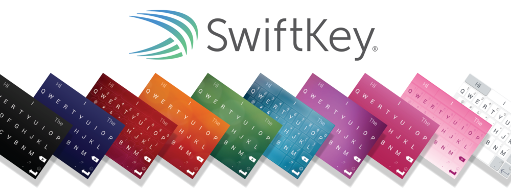
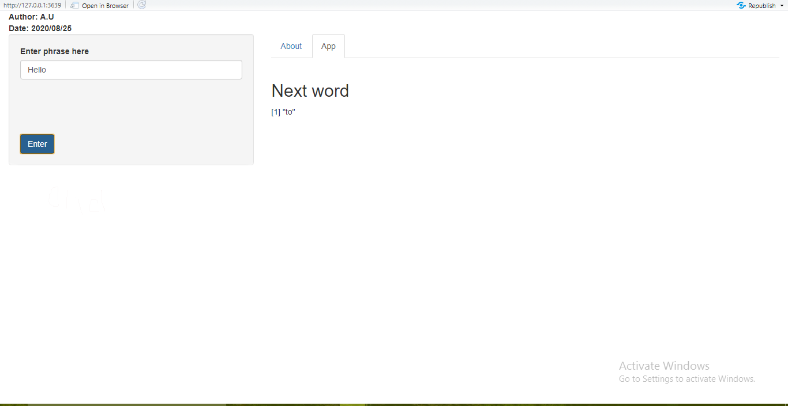

```{r setup, include=FALSE}
knitr::opts_chunk$set(echo = FALSE)
```

## 1. Overview

- This Presentation is created as part of the requirement of the Coursera Data Science Capstone course.

- The goal of this project is to build a predictive model to filter the next word which is user wish to obtained. This model is built under the data provided in SwiftKey. Most modern system smart phone keyboard is implemented today using these kind of the technology of SwiftKey.

<center>
{width=800px}
</center>


---------------------------------------------------------------------------

## 2. Methodology

- The model is trained on data provided by SwiftKey on blogs, news and twitter. The model is trained by 1% of sample.

- The model is always ready to adapted n-grams algorithms and the model mainly focused ordered results of quadgram, trigram and bigram.

<center>
{width=700px}
</center>

----------------------------------------------------------------------------

## User Guide

- This shiny application is easy to use. All instructions are given step by step and explained in the app description tab.

- User can be entered word or phrase then it will be given the next word.

<center>
{width=700px}
</center>

 
----------------------------------------------------------------------------

## References

- The shiny Application is available at <https://banchan.shinyapps.io/FinalProject/>

- Github Repository <https://github.com/AyomiUpeksha/DataSienceCapston_FinalProject>

